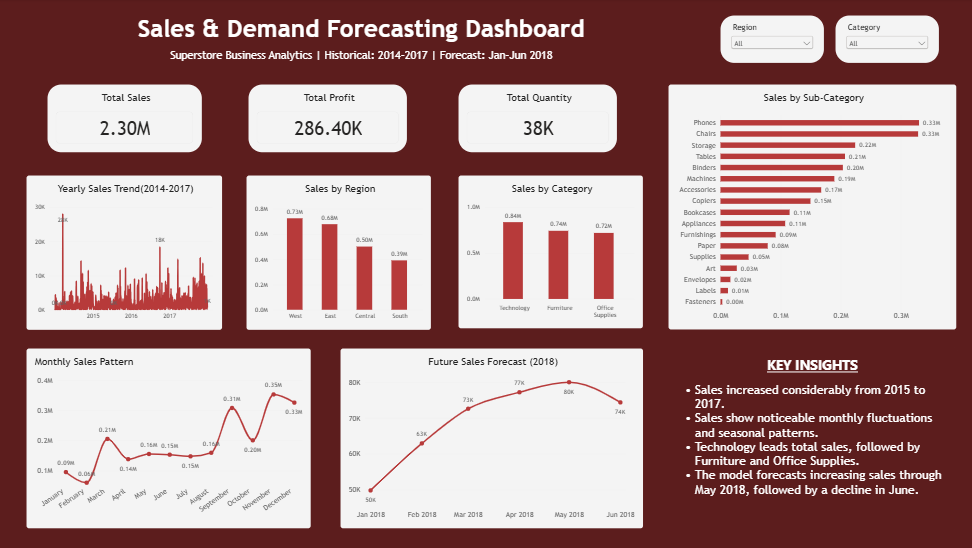

# 📊 Sales & Demand Forecasting for Businesses

## 📌 Project Overview

This project is developed as part of **Future Interns – Machine Learning Task 01**.

The project focuses on **Sales and Demand Forecasting for Businesses** using historical sales data. The aim is to understand past sales patterns, identify important trends, perform data analysis and visualization, and use Machine Learning to forecast future sales and demand.

The project also includes a **Power BI dashboard** to present the analyzed data and business insights in an interactive and easy-to-understand format.

---

## 🎯 Project Objective

The main objective of this project is to use historical sales data to:

- Understand sales and demand patterns
- Clean and prepare the dataset
- Perform exploratory data analysis
- Visualize important trends and relationships
- Prepare features for Machine Learning
- Build and evaluate a forecasting model
- Generate future sales/demand predictions
- Present the results using Power BI

The final output can help in understanding demand patterns and supporting data-driven business decisions.

---

## 🗂️ Dataset

The project uses historical sales data containing information related to sales and demand.

The dataset was examined and prepared before applying the Machine Learning model.

### Data Preparation

The following steps were performed as required during the analysis:

- Checked the dataset structure
- Examined missing values
- Checked data types
- Cleaned and prepared the data
- Performed exploratory analysis
- Created relevant features
- Prepared the data for model training and forecasting

---

## 🔍 Exploratory Data Analysis

Exploratory Data Analysis (EDA) was performed to understand the dataset and identify useful patterns.

The analysis includes:

- Sales trends over time
- Demand patterns
- Product/category-level analysis
- Distribution of sales
- Relationships between important variables
- Correlation analysis
- Data visualizations

Different charts and graphs were created using Python to make the patterns easier to understand.

---

## 📈 Data Visualizations

The project includes visualizations such as:

- Sales trend analysis
- Demand trend analysis
- Product/category-wise sales
- Time-based sales patterns
- Distribution plots
- Correlation analysis

These visualizations help in understanding how sales and demand change across different periods and categories.

---

## 🤖 Machine Learning

After preparing and analyzing the data, Machine Learning techniques were applied to forecast sales and demand.

### Machine Learning Workflow

The general workflow followed in the project was:

1. Data loading
2. Data cleaning
3. Exploratory Data Analysis
4. Feature engineering
5. Data preparation
6. Train-test split
7. Model training
8. Prediction
9. Model evaluation
10. Forecast generation

The trained model was used to generate predicted sales/demand values.

---

## 📊 Model Evaluation

The Machine Learning model was evaluated using suitable performance metrics.

The evaluation helps to understand how closely the predicted values match the actual values.

The project includes the model evaluation results and prediction analysis in the Jupyter Notebook.

---

## 🔮 Forecast Output

After training and evaluating the model, a separate output file was generated containing the forecasted results.

The forecast output can be used to examine the predicted sales/demand values for the required period.

---

## 📊 Power BI Dashboard

A Power BI dashboard was created to present the project findings visually.

The dashboard helps in understanding:

- Overall sales performance
- Sales trends
- Demand patterns
- Product/category performance
- Important business insights

### Dashboard Preview



---

## 📁 Project Files

| File | Description |
|---|---|
| `Sales_Demand_Forecasting.ipynb` | Main Jupyter Notebook containing data analysis, visualizations, Machine Learning and forecasting |
| `sales_data.csv` | Historical sales dataset used for the project |
| `forecast_output.csv` | Output file containing forecasted results |
| `PowerBI_Dashboard.png` | Power BI dashboard screenshot |
| `README.md` | Project documentation |

---

## 🛠️ Technologies Used

### Programming Language
- Python

### Libraries
- Pandas
- NumPy
- Matplotlib
- Scikit-learn

### Development Environment
- Jupyter Notebook

### Visualization & Business Intelligence
- Matplotlib
- Power BI

### Version Control
- GitHub

---

## 📋 Project Workflow

```text
Historical Sales Data
        ↓
Data Cleaning & Preparation
        ↓
Exploratory Data Analysis
        ↓
Data Visualization
        ↓
Feature Engineering
        ↓
Machine Learning Model
        ↓
Model Evaluation
        ↓
Sales & Demand Forecast
        ↓
Power BI Dashboard
```

---

## 💡 Key Learning Outcomes

Through this project, I gained practical experience in:

- Working with real-world style sales data
- Data cleaning and preprocessing
- Exploratory Data Analysis
- Data visualization using Python
- Feature engineering
- Applying Machine Learning
- Evaluating model performance
- Generating forecast predictions
- Creating business dashboards using Power BI
- Organizing and documenting a Machine Learning project on GitHub

---

## 🚀 Future Improvements

The project can be further improved by:

- Testing additional Machine Learning models
- Performing hyperparameter tuning
- Adding more time-based features
- Improving forecast accuracy
- Adding more interactive Power BI visuals
- Including additional business KPIs
- Deploying the forecasting model as a web application

---

## 👩‍💻 Author

**Tanisha**  
BCA Data Science Student

---

## 📌 Project Type

**Machine Learning | Sales Forecasting | Demand Forecasting | Data Analysis | Power BI**

---

## 🎓 Internship Task

**Future Interns – Machine Learning Task 01**

**Task:** Sales & Demand Forecasting for Businesses
